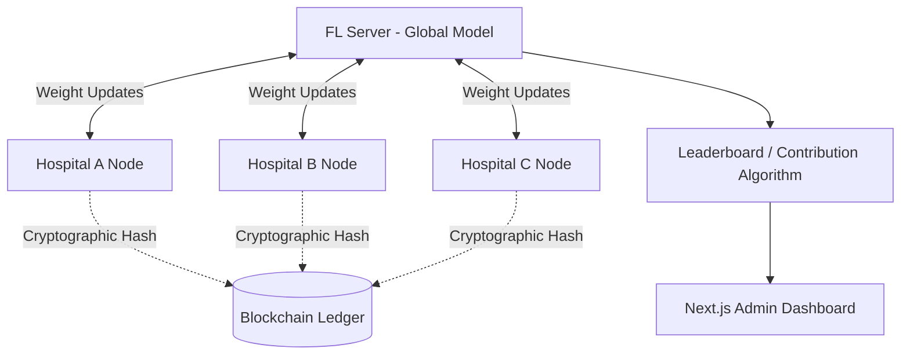

<div align="center">
  <br />
  <h1>🤝 TrustFL</h1>
  <p>
    <strong>A Privacy-Preserving Federated Learning Framework for Healthcare</strong>
  </p>
</div>

<br />

## 📖 Overview

**TrustFL** is an advanced simulation and management platform designed to facilitate secure, multi-institutional **Federated Learning (FL)** within the healthcare sector. By transmitting *only* model weights instead of raw, sensitive patient records, hospitals can collaboratively train robust Machine Learning models while strictly adhering to data privacy standards. 

To ensure accountability and prevent adversarial updates, TrustFL integrates with a simulated **Blockchain ledger** mechanism. This immutable public ledger tracks all model updates, verifies cryptographic hashes, and mathematically assigns reputation scores to hospital nodes based strictly on their tangible contribution to the global algorithm.

---

## ✨ Key Features

* 🧠 **Federated Machine Learning Simulation**: Visually track local node accuracy and the corresponding `FedAvg` Global updates across multiple epochs in real time.
* 🛡️ **Zero-Knowledge Privacy**: Simulates real-world security—raw patient data (like heart disease or diabetes indicators) never leaves the local institution.
* 🔗 **Blockchain-Backed Verification**: Cryptographically hashes and verifies every model update.
* 🏆 **Dynamic Leaderboard**: An automated contribution scoring system dynamically ranks participating hospitals (Gold, Silver, Bronze tiers) depending on the empirical quality of their weight updates.
* 📊 **Live Analytics Dashboard**: Beautiful UI visualizations featuring real-time training accuracy graphs, active node networking maps, and event-based training logs.
* 🛠️ **Administrative Control**: Robust role-based dashboards natively backed by relational SQL.

---

## 🛠 Tech Stack

TrustFL bridges a highly interactive frontend with a resilient, async backend framework:

### Frontend
- **Framework**: [Next.js (React)](https://nextjs.org/)
- **Language**: TypeScript
- **Styling**: Tailwind CSS & Vanilla Custom CSS Tokens
- **Visuals**: Framer Motion / Custom SVG Canvas logic

### Backend
- **Framework**: [FastAPI](https://fastapi.tiangolo.com/) (Python)
- **ORM / Database Tooling**: SQLAlchemy + Pydantic
- **Database Engine**: PostgreSQL
- **Migrations**: Alembic
- **Machine Learning Mechanics**: Real mathematical aggregations powering logical hospital node updates 

---

## 🏗️ Architecture



---

## 🚀 Getting Started

Follow these instructions to set up the monolithic TrustFL environment locally.

### Prerequisites
- Node.js (v18+)
- Python (v3.10+)
- PostgreSQL Server 
- Git

### 1. Database Setup
Ensure PostgreSQL is active. Create a new local database, for example: `trustfl_hospital_db`. Update your backend `.env` variables to properly route `DATABASE_URL`.

### 2. Backend Initialization
```bash
cd backend

# Create Virtual Environment & Activate
python -m venv venv
source venv/bin/activate  # On Windows: .\venv\Scripts\activate

# Install Dependencies
pip install -r requirements.txt

# Run Migrations & Seed Database
alembic upgrade head
python seed.py

# Start Python API
uvicorn app.main:app --reload --port 8001
```

### 3. Frontend Initialization
```bash
cd Frontend

# Install NPM Packages
npm install

# Start Next.js Development Server
npm run dev
```

Your system is now completely connected. Navigate to `http://localhost:3000` to interact with the environment!

---

## 👨‍💻 Author

Built with ♥ by **Yashi**. 
